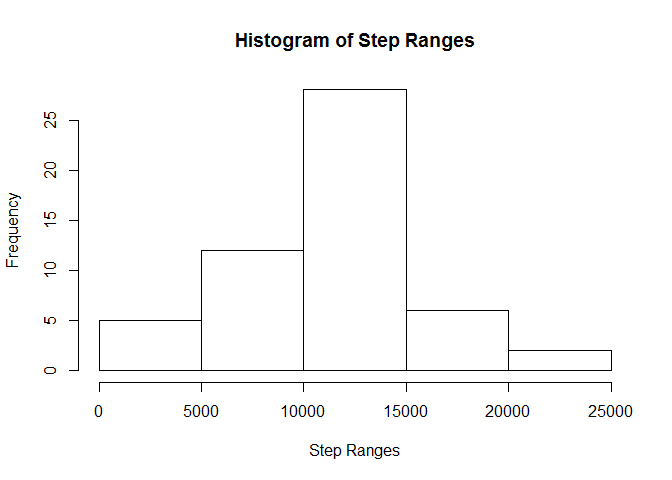
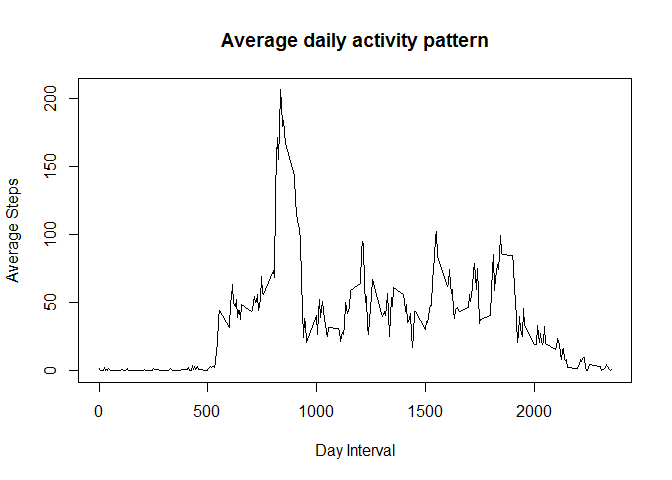
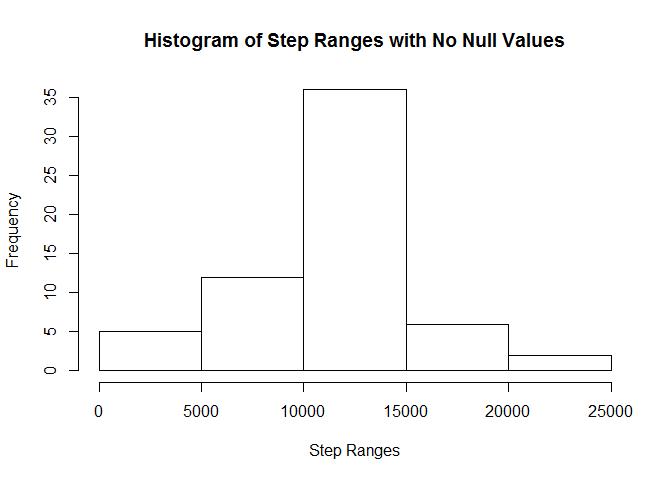
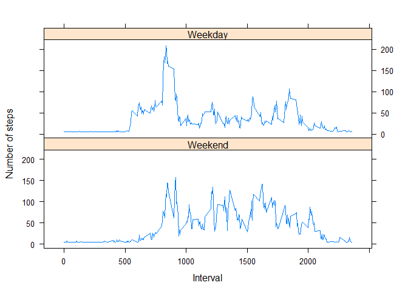

# Reproducible Research: Peer Assessment 1 by Deborah Zomer


```r
options(scipen = 999)
```

## Loading and preprocessing the data

```r
  unzip("activity.zip")
  activity <- read.csv("activity.csv", header= TRUE)
```

## What is mean total number of steps taken per day?

Histogram of steps per day


```r
# Aggregate Sum Steps per day
  activityperday<-aggregate(activity$steps, by=list(Date=activity$date), FUN=sum)
# Histogram
  hist(activityperday$x, xlab = "Step Ranges", main="Histogram of Step Ranges")
```

<!-- -->

Mean and median of the total number of steps taken per day


```r
  mean_activity<-round(mean(activityperday$x,na.rm = TRUE),digits = 2)
  median_activity<-median(activityperday$x,na.rm = TRUE)
```
The mean steps per day is 10766.19 and the median is 10765

## What is the average daily activity pattern?


```r
# Aggregate Mean Steps per interval
  activityperinterval<-aggregate(activity$steps, by=list(Interval=activity$interval), FUN=mean, na.rm = TRUE)

# Time series plot
  plot(activityperinterval$Interval,activityperinterval$x, type = "l", xlab = "Day Interval", ylab = "Average Steps", main = "Average daily activity pattern")
```

<!-- -->

```r
# Interval with max number of steps
  max_steps<-max(activityperinterval$x)
  max_interval<-subset(activityperinterval,x==max_steps)$Interval
```

The interval with maximum number of steps is 835

## Imputing missing values


```r
# Calculate Total Missing Values
  total_na<-sum(is.na(activity$steps))

# Fill Missing Values using the average of all observations
  activity_No_NAs<-activity
  activity_No_NAs$steps[which(is.na(activity_No_NAs$steps))]<-mean(activity_No_NAs$steps, na.rm=TRUE)
```

Histogram of steps per day with no null values


```r
# Aggregate Sum Steps per day
  activityperday_No_NAs<-aggregate(activity_No_NAs$steps, by=list(Date=activity_No_NAs$date), FUN=sum)

  # Histogram
  hist(activityperday_No_NAs$x, xlab = "Step Ranges", main="Histogram of Step Ranges with No Null Values")
```

<!-- -->

Mean and median of the total number of steps taken per day with no null values


```r
  mean_activity_No_NAs<-round(mean(activityperday_No_NAs$x,na.rm = TRUE),digits = 2)
  median_activity_No_NAs<-round(median(activityperday_No_NAs$x,na.rm = TRUE),digits=2)
```
The mean steps per day with no Null values is 10766.19 and the median is 10766.19

The mean steps per day initially was 10766.19 and after replacing null values it is 10766.19

The median steps per day initially was 10765 and after replacing null values it is 10766.19

The impact on the total per day is that there are many more steps per day but the mean is the same and median almost the same.


## Are there differences in activity patterns between weekdays and weekends?


```r
# Create a copy of the Activity dataframe
  activity1<-activity_No_NAs

# Convert date column in date format  
  activity1$date<-as.Date(activity1$date)
  
# Create a list of week days
  week_days<-c('Monday','Tuesday','Wednesday','Thursday','Friday')
  
# Add a column called WD equal to weekend or weekday depending on the results from weekdays() function  
  activity1$WD<-factor((weekdays(activity1$date) %in% week_days), 
    levels=c(FALSE,TRUE), labels=c('Weekend','Weekday'))

# Aggregate Mean Steps per interval per week day type
  activityperintervalperWD<-aggregate(activity1$steps, by=list(Interval=activity1$interval,WD=activity1$WD), FUN=mean, na.rm = TRUE)

# Time series plot per week day type
  library(lattice) 

  xyplot(x~Interval | WD, data = activityperintervalperWD,layout = c(1, 2), type = "l",
         xlab = "Interval", ylab = "Number of steps")
```

<!-- -->
  
